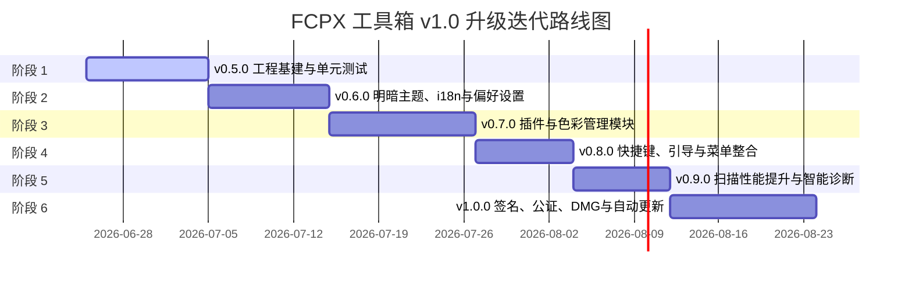

# FCPX 工具箱 - 上市级完整项目提升计划 (v2.0)

## 一、项目现状分析

### 1.1 当前状态 (v0.4.0)

项目已从原本的 v0.3.x 快速迭代至 **v0.4.0** 版本。在保留早期 Electron 原型的同时，核心 SwiftUI 原生应用已经从最初的 2 个功能模块（清理助手 + 模板库）大幅扩充为 **8 大功能模块**。

然而，底层工程质量与平台特性适配（如测试、日志、偏好设置、深色模式、多语言等）仍处于原型阶段。

#### 功能模块现状

| 模块名称 | 标识图标 | 状态 | 功能说明 |
| --- | --- | --- | --- |
| ⚡ **快捷打开** | `bolt.horizontal.circle` | ✅ 已实现 | 一键访问 FCPX 常用目录（Motion 模板、配置等），支持启动 FCPX |
| 📊 **进程管理** | `activity` | ✅ 已实现 | 监控 FCPX 运行状态（PID/内存），支持强制退出，2s 自动刷新 |
| 🧹 **清理助手** | `sparkles` | ✅ 已实现 | 扫描 `.fcpbundle`，对渲染/分析/媒体缓存进行风险分级与安全删除 |
| 🧩 **模板库** | `square.grid.2x2` | ✅ 已实现 | 浏览 Motion Templates 目录，支持分类、搜索、筛选与模板删除 |
| ❤️ **健康检查** | `heart.text.square` | ✅ 已实现 | 扫描资源库完整性（缺失文件、原始/代理媒体结构等）并展示指标 |
| 📦 **归档管理** | `archivebox` | ✅ 已实现 | 快速素材归档、清单生成、归档历史持久化以及一键恢复功能 |
| 💬 **快速字幕** | `captions.bubble` | ✅ 已实现 | 基于 macOS Speech 框架 ASR 语音识别自动生成 SRT 格式字幕 |
| 📤 **输出管理** | `square.and.arrow.up.on.square` | ✅ 已实现 | 解析 plist 配置文件，管理输出目标（Share Destinations），内置模板 |

#### 平台与工程基建现状

| 维度 | 状态 | 评估与缺失 |
| --- | --- | --- |
| **偏好设置** | ❌ 缺失 | 无统一的用户设置面板与偏好存储系统 |
| **多语言 (i18n)** | ⚠️ 缺失 | 代码中绝大多数中文字符串为硬编码，未提取至 `Localizable.strings` |
| **深色模式** | ⚠️ 部分 | 实现了基本的品牌配色，但未适配系统深色/浅色模式无缝切换 |
| **日志系统** | ❌ 缺失 | 缺乏统一的日志落盘和控制台输出机制，难以排查线上故障 |
| **单元测试** | ❌ 极低 | `Tests/FCPXToolboxTests` 目录仅有 `PlaceholderTests.swift` 占位符，核心扫描与数据处理无单元测试覆盖 |
| **分发打包** | ⚠️ 基础 | 仅支持 zip 手动打包，未配置苹果开发者签名、公证（Notarization）与 DMG 构建脚本 |
| **自动更新** | ❌ 缺失 | 缺少 Sparkle 框架集成，无法向用户推送增量更新 |
| **用户引导** | ❌ 缺失 | 无首次打开的 Welcome 界面与完全磁盘访问权限（FDA）引导 |

### 1.2 技术栈

- **开发语言**：Swift 5.9
- **UI 框架**：SwiftUI
- **包管理器**：Swift Package Manager (SPM)
- **目标平台**：macOS 14.0+ (Sonoma)
- **底层框架**：
  - `Speech` (ASR 语音识别)
  - `AVFoundation` (音频文件读取)
  - `Darwin` (进程系统 API)
  - `ImageIO` / `AppKit` (模板缩略图高效解析)

---

## 二、后续版本升级的详细计划

为了将当前拥有 8 个模块的 v0.4.0 打造为一个达到**上市分发标准**、**工程架构严谨**、**用户体验极致**的 v1.0.0 正式版应用，我们制定了后续的增量迭代计划，共分为 6 个阶段（v0.5.0 -> v1.0.0）。

### 阶段 1：v0.5.0 - 工程基础、日志与单元测试 (Infrastructure & Quality)
**目标**：重构代码架构，建立坚固的底层设施和测试保护网，消除隐患。

#### 1. 主要任务
*   **统一日志系统 (`AppLogger`)**：
    *   基于 macOS 原生 `OSLog` 封装，替换代码中所有的 `print()`。
    *   在 `Library/Logs/FCPXToolbox/` 建立每日回滚日志文件。
    *   记录关键步骤：扫描开始/结束、删除动作、ASR 语音识别状态、导出 Plist 错误。
*   **标准错误模型 (`AppError`)**：
    *   定义 `FCPXToolboxError` 枚举，实现 `LocalizedError` 协议，提供详细的错误解释。
    *   统一捕获磁盘无读写权限、ASR 权限拒绝、Plist 解析损坏等边界错误。
*   **偏好设置持久化 (`AppPreferences`)**：
    *   基于 `UserDefaults` 封装属性包装器，持久化存储用户配置项。
*   **单元测试网络覆盖**：
    *   **清理扫描测试**：针对 `Scanner` 建立 `SampleLibrary.fcpbundle` 占位结构进行模拟扫描，验证缓存分类（安全项、代理媒体等）的正确性。
    *   **模板解析测试**：验证 `TemplateScanner` 对用户与系统级 Motion 模板的识别能力。
    *   **文件安全删除测试**：确保 `FileMover` (垃圾箱移动) 方法不会意外删除原始素材。

#### 2. 新增与变更文件
*   `native/Sources/FCPXToolbox/Core/Logging/AppLogger.swift` (新增)
*   `native/Sources/FCPXToolbox/Core/Errors/AppError.swift` (新增)
*   `native/Sources/FCPXToolbox/Core/Persistence/AppPreferences.swift` (新增)
*   `native/Sources/FCPXToolbox/Utils/FCPXPaths.swift` (新增，管理各种 FCPX 默认路径)
*   `native/Tests/FCPXToolboxTests/ScannerTests.swift` (新增)
*   `native/Tests/FCPXToolboxTests/CleanerTests.swift` (新增)
*   `native/Tests/FCPXToolboxTests/TemplateScannerTests.swift` (新增)

---

### 阶段 2：v0.6.0 - 用户体验适配、多语言与偏好 UI (UX & Localization)
**目标**：完成外观与多语言国际化，提供用户可自定义设置面板。

#### 1. 主要任务
*   **深浅色主题适配**：
    *   重构 `Theme.swift`，定义语义化颜色系统（`backgroundPrimary`、`backgroundSecondary`、`accentColor` 等），自动响应系统 Dark Mode。
    *   替换硬编码颜色，确保文本在深色模式下具有绝佳的对比度。
*   **全面国际化 (i18n)**：
    *   建立 `en.lproj/Localizable.strings` 与 `zh-Hans.lproj/Localizable.strings`。
    *   将 8 个模块中所有的 UI 文本、警告提示、分级描述全部接入本地化字符串。
*   **设计并开发「设置 (Settings)」面板**：
    *   使用 SwiftUI 原生 `Settings` 场景，分栏提供：
        *   *通用*：默认扫描路径、清理前二次确认开关、启动默认板块。
        *   *外观与语言*：主题切换（跟随系统/亮色/深色）、语言选择。
        *   *高级*：日志输出级别、废纸篓保留天数警告、磁盘空间不足警报阈值。
*   **创建标准「关于 (About)」窗口**：
    *   展示 App 图标、版本号、版权、官方 Github 开源协议，并提供一键获取系统诊断报告的功能。

#### 2. 新增与变更文件
*   `native/Sources/FCPXToolbox/App/Theme.swift` (重构，支持动态语义颜色)
*   `native/Sources/FCPXToolbox/Features/Settings/SettingsView.swift` (新增)
*   `native/Sources/FCPXToolbox/Features/About/AboutView.swift` (新增)
*   `native/Sources/FCPXToolbox/Resources/en.lproj/Localizable.strings` (新增)
*   `native/Sources/FCPXToolbox/Resources/zh-Hans.lproj/Localizable.strings` (新增)

---

### 阶段 3：v0.7.0 - 新增核心模块：插件管理与色彩 LUT (Extend Core Modules)
**目标**：将工具箱扩展至 10 大功能模块，加入视频后期高频使用的「插件管理」与「色彩LUT」。

#### 1. 主要任务
*   **🔌 插件管理器 (Plugin Manager) - 模块 9**：
    *   扫描系统插件路径 `~/Library/Plug-Ins/FxPlug/` 及 `/Library/Plug-Ins/FxPlug/`。
    *   列表展示所有 FxPlug 插件的名称、厂商、大小、状态（启用/禁用）。
    *   通过重命名后缀或移动至特定备份目录，实现插件的「一键临时禁用」与「恢复启用」，方便用户定位插件冲突造成的 Final Cut Pro 闪退问题。
*   **🎨 色彩管理 (Color Manager) - 模块 10**：
    *   扫描 FCPX 自定义 LUT 目录 `~/Library/Application Support/ProApps/Custom LUTs/`。
    *   扫描色彩预设目录 `~/Library/Application Support/ProApps/Color Presets/`。
    *   展示 LUT 列表，支持导入第三方 `.cube` 文件，支持一键清空无用色彩预设。

#### 2. 新增与变更文件
*   `native/Sources/FCPXToolbox/Features/Plugins/` (新增目录)
    *   `PluginModels.swift`
    *   `PluginScanner.swift`
    *   `PluginManagerView.swift`
*   `native/Sources/FCPXToolbox/Features/Color/` (新增目录)
    *   `ColorModels.swift`
    *   `ColorScanner.swift`
    *   `ColorManagerView.swift`
*   `native/Sources/FCPXToolbox/App/RootView.swift` (修改，在侧边栏增加两个新板块)

---

### 阶段 4：v0.8.0 - 快捷键管理、欢迎页与首发引导 (Onboarding & Menus)
**目标**：增强高级用户体验，提供快捷键集备份、全新 Onboarding 引导及 macOS 全局菜单深度整合。

#### 1. 主要任务
*   **⌨️ 快捷键管理 (Shortcuts Manager) - 模块 11**：
    *   扫描 FCPX 快捷键配置目录 `~/Library/Application Support/Final Cut Pro/Command Sets/`。
    *   支持用户自定义快捷键预设的导出、导入分享，备份多套按键映射。
*   **欢迎页与完全磁盘访问权限 (FDA) 引导**：
    *   为新用户设计 Onboarding 面板，介绍 11 大模块。
    *   针对 FCPX 扫描必不可少的「完全磁盘访问权限」，提供可视化的步骤引导，并附带一键打开系统设置面板的快捷按钮（通过 `openSystemSettings`）。
*   **Dock 与全局菜单深度绑定**：
    *   完善 `CommandGroup`，允许通过 `⌘1` ~ `⌘9` 快速切换侧边栏视图。
    *   集成 Dock 菜单，支持直接右键 Dock 图标选择「开始扫描」、「生成字幕」等快捷动作。

#### 2. 新增与变更文件
*   `native/Sources/FCPXToolbox/Features/Shortcuts/` (新增目录)
    *   `ShortcutModels.swift`
    *   `ShortcutManagerView.swift`
*   `native/Sources/FCPXToolbox/Features/Onboarding/OnboardingView.swift` (新增)
*   `native/Sources/FCPXToolbox/App/AppCommands.swift` (新增，定义全局菜单指令)

---

### 阶段 5：v0.9.0 - 性能极限调优与智能诊断增强 (Performance & Diagnostics)
**目标**：对海量工程素材和老旧设备进行专项性能优化，提供自动化问题修复。

#### 1. 主要任务
*   **多线程并发扫描优化**：
    *   在 `Cleanup/Scanner.swift` 中使用 Swift 并发框架的 `TaskGroup`。
    *   对大体积 FCPX 资源库的扫描任务进行并行遍历，预计将机械硬盘/外置 SSD 的扫描耗时缩短 40% 以上。
*   **内存池管理与列表虚拟化**：
    *   在模板库中，针对缩略图加载使用 `NSCache` 缓存池，防止快速滚动时内存激增。
    *   所有大型数据表格（如清理文件项列表）全面采用 Lazy 加载技术。
*   **❤️ 健康检查功能增强（智能自动修复）**：
    *   在 `HealthCheck` 中不仅发现问题（如缓存异常、配置文件损坏），而且提供「一键修复」按钮。例如：自动安全清空特定渲染锁文件，自动重建缺失的必要事件文件夹。
*   **ASR 快速字幕引擎升级**：
    *   支持大音频文件自动切片后并发识别，大幅缩短 SRT 字幕生成等待时长。

#### 2. 新增与变更文件
*   `native/Sources/FCPXToolbox/Cleanup/Scanner.swift` (重构并发逻辑)
*   `native/Sources/FCPXToolbox/Templates/ThumbnailView.swift` (引入内存缓存)
*   `native/Sources/FCPXToolbox/HealthCheck/HealthCheckView.swift` (新增自动修复交互)

---

### 阶段 6：v1.0.0 - 正式分发、自动更新、签名与公证 (Distribution & Release)
**目标**：完成苹果安全公证，集成自动更新机制，输出生产级构建产物，正式发布 v1.0.0。

#### 1. 主要任务
*   **集成 Sparkle 2.x 自动更新**：
    *   通过 SPM 引入 Sparkle 框架。
    *   配置 Appcast XML 升级订阅源。
    *   在设置与关于中添加「自动检查更新」及「立即检查」的逻辑。
*   **自动化构建脚本升级 (`release.sh`)**：
    *   支持编译 Universal Binary（Apple Silicon 和 Intel 架构原生支持）。
    *   通过 `xcodebuild` 导出 `.app` 后，利用 Developer ID 证书进行代码签名（Code Signing）。
    *   调用苹果官方 `xcrun notarytool` 提请公证，公证成功后将票据缝合（Stapling）进安装包。
*   **生成精美的安装盘 (DMG)**：
    *   使用 `create-dmg` 脚本，生成带有 FCPX 工具箱专属背景图、应用程序拖拽快捷方式的 DMG 分发安装盘。
*   **商业化物料与帮助文档落地**：
    *   输出中英文双语《FCPX 工具箱用户手册》（Markdown），存放于官方网站。
    *   配合输出一套高清功能截图与操作演示动图。

#### 2. 新增与变更文件
*   `native/Sources/FCPXToolbox/Core/Updater/AppUpdater.swift` (新增，基于 Sparkle)
*   `scripts/build-native.sh` (重构为多渠道构建)
*   `scripts/notarize.sh` (新增，安全签名与公证脚本)
*   `scripts/create-dmg.sh` (新增，DMG 生成脚本)

---

## 三、开发路线图与里程碑

### 里程碑交付件与成果标准

| 版本号 | 功能模块数 | 核心交付成果 | 验收通过标准 |
| --- | --- | --- | --- |
| **v0.5.0** | 8 | 统一日志类、标准化错误机制、首批测试用例 (Coverage > 50%) | 所有本地及 CI 单元测试 100% 通过，终端无任何裸露的 `print()` |
| **v0.6.0** | 8 + 设置 | 中英文 Localizable.strings 覆盖率 100%，独立设置窗口，明暗模式无瑕疵 | 无硬编码中文，深浅色切换时文字无反色、无不可读区域 |
| **v0.7.0** | 10 + 设置 | 插件管理器 UI、插件状态修改逻辑、色彩 LUT 管理 | 可成功临时移走插件并恢复，支持导入 `.cube` 至对应目录 |
| **v0.8.0** | 11 + 设置 | 快捷键配置备份视图、FDA 引导屏、Dock 菜单扩展 | 首次启动弹窗引导 FDA 流程正确，Dock 菜单能成功唤醒 App 并传递动作 |
| **v0.9.0** | 11 + 设置 | 并行扫描组件、智能修复行为引擎、大模板流畅滚动 | 对比单线程，扫描海量库耗时下降 40% 以上，内存曲线稳定不飙升 |
| **v1.0.0** | 11 + 设置 | Sparkle 升级提醒、公证完备的 DMG 安装包、用户文档 | 双击 DMG 无苹果未信任警告提示，线上自动更新检测功能工作正常 |

---

## 四、风险分析与防范措施

1.  **关于「完全磁盘访问权限 (FDA)」的拦截风险**：
    *   *风险*：由于 FCPX 缓存库分布在不同磁盘，若无 FDA，大部分文件的扫描和移动都会遭遇 `Permission Denied`。
    *   *应对*：强化 Onboarding 中的引导页设计，用动图与简明文字告知用户如何前往「系统设置 -> 隐私与安全性 -> 完全磁盘访问权限」进行勾选，并在启动时使用 `FileManager` 的可读性测试做预检。
2.  **Sparkle 集成与沙盒（Sandbox）冲突风险**：
    *   *风险*：若要在 Mac App Store 上架，App 必须开启沙盒，这会导致 Sparkle 自动更新机制失效。
    *   *应对*：采用多渠道构建策略。在 `scripts/build-native.sh` 中通过编译选项（如 Swift 条件编译 `#if SANDBOX`）区分 **独立分发版（集成 Sparkle 更新，无沙盒限制）** 和 **Mac App Store 版（无 Sparkle 更新，开启 App Sandbox 权限）**。
3.  **FCPX 内部 Plist 与私有目录结构变更风险**：
    *   *风险*：Final Cut Pro 大版本更新可能更改 `.fcpbundle` 内部结构或 Share Destinations Plist 的存储键名。
    *   *应对*：健康检查与输出管理模块均采用**非侵入式读取**，解析发生错误时进行 Graceful Fallback（优雅降级），提示用户更新工具箱，绝不强制闪退。
4.  **ASR 字幕识别对系统多语言包的依赖限制**：
    *   *风险*：macOS 原生 Speech 识别在部分离线环境下需要用户手动下载语言包，否则会识别失败或需要联网。
    *   *应对*：在字幕识别视图中提供「网络连接提示」与「离线包状态检测」，告知用户当前识别语言是否支持本地离线高精度识别。
