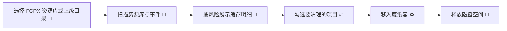

# 🎬 FCPX 工具箱

<p align="center">
  
</p>

<p align="center">
  <strong>为 Final Cut Pro 用户准备的 macOS 原生工具箱。</strong><br>
  安全扫描 FCPX 资源库，清晰查看可清理缓存，并快速浏览 Motion 模板资源。
</p>

<p align="center">
  <a href="LICENSE"></a>
  
  
  
</p>

## ✨ 它能帮你做什么

剪 Final Cut Pro 项目久了，资源库里很容易堆满渲染文件、波形缓存、分析缓存、代理媒体和优化媒体。`FCPX 工具箱` 的目标很直接：让你在清理前看清楚每一项是什么、占多少空间、风险如何，然后把可再生成的内容移到 macOS 废纸篓。



## 🧰 核心功能

- 🧹 **安全清理 FCPX 生成文件**：默认只勾选可重新生成的缓存。
- 📦 **资源库级空间分析**：查看总占用、可清理空间、文件数量和修改时间。
- 🛡️ **风险分级**：渲染/分析/波形/缩略图缓存为安全项，代理/优化/共享导出需手动确认，原始素材只读展示。
- 🗑️ **移到废纸篓**：不直接永久删除，保留一次反悔机会。
- 🧩 **Motion 模板库浏览**：扫描用户与系统模板目录，按效果、转场、字幕/标题、发生器等分类浏览。
- ⚡ **原生 macOS 体验**：SwiftUI 构建，界面轻量、响应清爽。

## 🖼️ 项目预览

| 模块 | 说明 |
| --- | --- |
| 🧹 清理 | 扫描 `.fcpbundle`、`.fcpproject` 和 FCPX 事件目录，统计可清理缓存 |
| 🧩 模板库 | 浏览 Motion Templates 中的效果、转场、字幕/标题、发生器和合成 |
| 🧪 Electron 原型 | 保留早期 JS/Electron 版本，方便对比和后续迁移 |

## ✅ 当前清理范围

默认安全项：

- `Render Files`
- `Analysis Files`
- `Waveform Cache Files`
- `Thumbnail Media`

需要手动确认：

- `Transcoded Media / High Quality Media`
- `Transcoded Media / Proxy Media`
- `Shared Items`

永不清理：

- `Original Media`

## 🚀 快速开始

### 运行 SwiftUI 原生版

```bash
cd native
swift run
```

### 构建 macOS App

```bash
scripts/generate-icon.py
iconutil -c icns assets/AppIcon.iconset -o assets/AppIcon.icns
scripts/build-native.sh
```

构建后的 App 位于：

```text
dist/native-v0.3/FCPX 工具箱.app
```

### 打包本地安装包

```bash
scripts/package-local.sh
```

输出：

```text
dist/FCPXTools-0.3.0.zip
```

### 运行 Electron 原型

```bash
npm install
npm start
```

> Electron 版本是早期原型，当前主线以 `native/Sources/FCPXToolbox` 为准。

## 🗂️ 目录结构

```text
.
├── assets/                  # App 图标资源
├── native/                  # SwiftUI 原生应用
│   ├── Package.swift
│   ├── Sources/FCPXToolbox/
│   └── Tests/FCPXToolboxTests/
├── scripts/                 # 图标生成、构建、打包脚本
├── src/                     # Electron 原型
├── package.json             # Electron 原型依赖与打包配置
└── README.md
```

## 🧑‍💻 技术栈

- 🍎 Swift 5.9
- 🖥️ SwiftUI
- 📦 Swift Package Manager
- ⚙️ Electron 原型
- 🧼 macOS `FileManager.trashItem` 安全移入废纸篓

## ⚠️ 使用提醒

- 建议在清理前关闭 Final Cut Pro，避免资源库正在写入。
- 第一次扫描大体量素材盘时可能需要更久，取决于磁盘速度和文件数量。
- 代理媒体、优化媒体和共享导出文件会影响工作流，请确认后再清理。
- 本项目不会删除 `Original Media`。

## 🤝 贡献

欢迎提交 Issue 和 Pull Request。适合贡献的方向包括：

- 扫描规则补充
- UI 体验优化
- 更完整的测试 fixture
- 签名、公证和正式 DMG 分发流程
- 英文界面与多语言支持

## 📄 开源协议

本项目基于 [MIT License](LICENSE) 开源。
