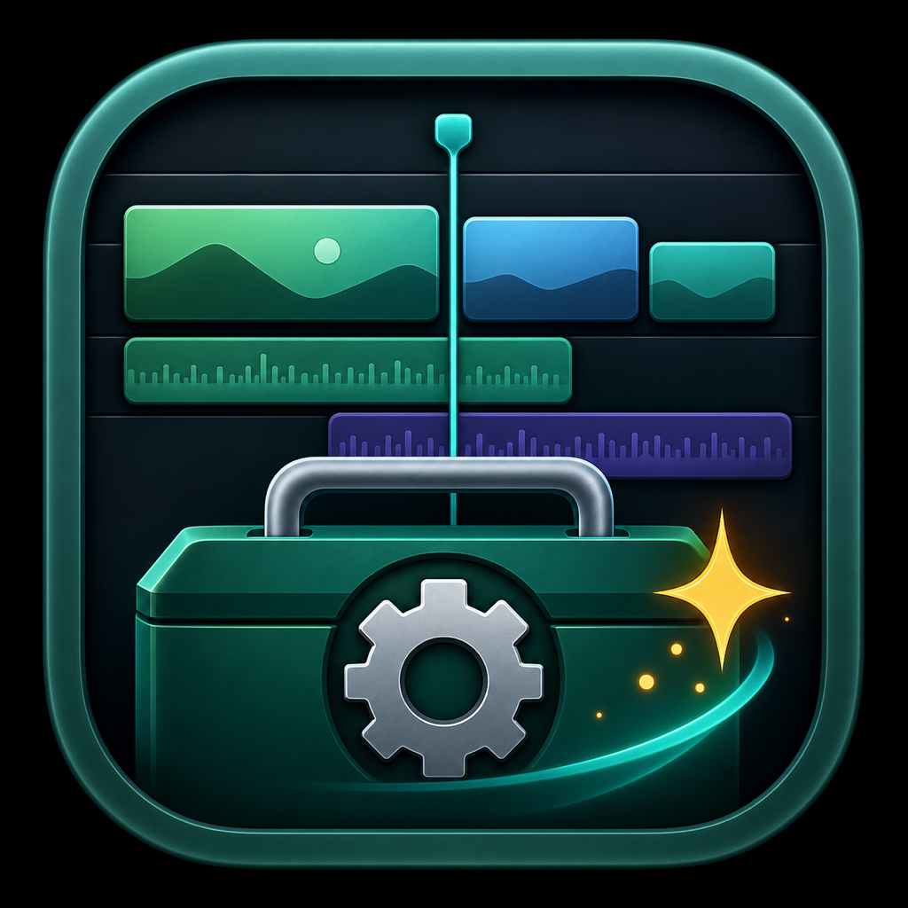

<div align="center">


# 🎬 FCPX 工具箱

**为 Final Cut Pro 剪辑师打造的 macOS 原生瑞士军刀** ✨<br>
基于 SwiftUI 构建 · 10 大模块 · 本地运行 · 安全清理 · 一键字幕

<p>
  <a href="https://github.com/Gary23333/FCPXTOOLS/releases/tag/v0.5.0">
    
  </a>
  <a href="./docs/index.html">
    
  </a>
</p>

<p>
  
  
  
  
  
</p>

</div>

---

## 📖 目录

- [✨ 为什么选择 FCPX 工具箱？](#-为什么选择-fcpx-工具箱)
- [🚀 v0.5.0 重磅更新](#-v050-重磅更新)
- [🎨 界面一览](#-界面一览)
- [🧰 十大功能模块](#-十大功能模块)
- [💾 下载与安装](#-下载与安装)
- [⚙️ 系统要求](#️-系统要求)
- [🛠️ 构建与运行](#️-构建与运行)
- [🔧 技术栈](#-技术栈)
- [⚠️ 使用提醒](#️-使用提醒)
- [🗺️ 路线图](#️-路线图)
- [🤝 参与贡献](#-参与贡献)
- [📄 开源协议](#-开源协议)
- [🙏 致谢](#-致谢)

---

## ✨ 为什么选择 FCPX 工具箱？

剪辑师的电脑里永远缺一个**趁手的小工具**：

- 🗂️ FCPX 资源库越用越大，却不知道哪些缓存可以删？
- 🎞️ Motion Templates 散落在各个角落，找个模板像寻宝？
- 🎤 手动打字幕打到手酸，想试试本地语音识别？
- 📦 项目归档像搬仓库，生怕漏了文件？

**FCPX 工具箱**就是来解决这些“小而烦”的问题的！

它不是一个臃肿的插件市场，也不是一个花里胡哨的启动器，而是一个
**专注于 Final Cut Pro 后期工作流**的 macOS 原生工具箱。所有操作都在本地完成，
没有账号、没有订阅、没有云端上传，你的素材永远只属于你自己 🔒

> 🎯 **核心理念**：让剪辑师把更多时间花在创作上，而不是和文件系统搏斗。

---

## 🚀 v0.5.0 重磅更新

v0.5.0 是一次从底层到界面的全面升级，我们用 **SwiftUI** 把整个应用重写了一遍，
带来了更流畅的动画、更一致的交互，以及一套为暗房剪辑场景专门调校的 **Neo 视觉系统**。

| 🌟 亮点 | 说明 |
| --- | --- |
| **原生 SwiftUI 重写** | 彻底告别旧架构，统一使用 Swift Package Manager 管理依赖与构建。 |
| **Neo 视觉系统** | 高对比度面板、像素级边框、自定义字体与硬朗阴影，专为暗光剪辑室设计。 |
| **实时状态栏** | 底部状态栏实时显示 FCPX 运行状态与内存占用，点击呼出进程管理浮层。 |
| **首次启动引导** | 新用户引导页帮助快速完成权限配置，降低上手门槛。 |
| **模板库大升级** | 缩略图预览、五大分类筛选、分页浏览、一键删除，管理 Motion Templates 从未如此轻松。 |
| **安全清理策略** | 风险分级 + 系统级移入废纸篓，清理缓存绝不碰原始媒体。 |
| **本地语音识别** | 基于 macOS Speech 框架，音频/视频直接生成 SRT，无需上传云端。 |

<details>
<summary>📜 查看完整更新日志</summary>

### v0.5.0
- 使用 SwiftUI 完全重写原生 macOS 应用
- 引入 Neo 设计系统：侧边栏、面板、徽章、按钮、输入框等统一组件
- 新增 10 大功能模块：快捷打开、清理助手、模板库、插件管理、色彩管理、快捷键管理、健康检查、归档管理、快速字幕、输出管理
- 新增首次启动引导页、设置页、关于页
- 新增底部实时状态栏与进程管理浮层
- 模板库支持缩略图、分类、分页、删除
- 清理助手支持风险分级与批量安全清理
- 快速字幕支持多语言识别与 SRT 导出

### v0.4.x 及更早
- 早期原型与功能验证

</details>

---

## 🎨 界面一览

<div align="center">



<p><em>✨ 精心调校的暗色界面，长时间剪辑也不累眼 ✨</em></p>

</div>

> 📸 **应用截图**：由于 README 体积考虑，完整界面截图将陆续补充到 [docs/index.html](./docs/index.html) 与 GitHub Releases 中。
> 现在你可以直接下载体验，或者点击下方产品主页在线预览设计稿。

---

## 🧰 十大功能模块

我们把剪辑师最常用的操作整理成了 **10 个核心模块**，按需使用，互不打扰。

### ⚡ 快捷工具

| 模块 | 图标 | 说明 |
| --- | :---: | --- |
| **快捷打开** | 🚀 | 一键进入 FCPX 常用目录，直接启动 Final Cut Pro，告别 Finder 里层层翻找。 |

### 📁 资源管理

| 模块 | 图标 | 说明 |
| --- | :---: | --- |
| **🧹 清理助手** | 🧹 | 扫描 `.fcpbundle` 资源库，按风险分级清理渲染、波形、分析等缓存，释放磁盘空间。 |
| **🎨 模板库** | 🎨 | 浏览 Motion Templates，支持效果、转场、字幕、发生器、合成分类检索与缩略图预览。 |
| **🧩 插件管理** | 🧩 | 集中管理 FCPX / Motion 插件，快速启用、禁用与定位插件文件。 |
| **🌈 色彩管理** | 🌈 | 查看与整理 LUT、色彩预设，辅助统一项目色彩工作流。 |
| **⌨️ 快捷键管理** | ⌨️ | 浏览、备份与恢复 FCPX 快捷键命令集，换机也能秒回手感。 |
| **💗 健康检查** | 💗 | 8 项指标扫描资源库完整性，按健康 / 警告 / 严重分级，提前发现潜在风险。 |
| **📦 归档管理** | 📦 | 素材库快速归档、生成清单、持久化历史记录，支持一键恢复。 |

### 🎬 创作辅助

| 模块 | 图标 | 说明 |
| --- | :---: | --- |
| **📝 快速字幕** | 📝 | 基于 macOS Speech 框架的 ASR 语音识别，自动生成 SRT 字幕，本地处理不上云。 |
| **📤 输出管理** | 📤 | 管理 FCPX 输出目标，查看、复制、删除、导出与预设模板。 |

---

## 💾 下载与安装

### 方式一：下载预编译版本（推荐）

1. 进入 👉 [GitHub Releases v0.5.0](https://github.com/Gary23333/FCPXTOOLS/releases/tag/v0.5.0)
2. 下载 `FCPXTools-0.5.0.zip`
3. 解压后将 `FCPX 工具箱.app` 拖入 **应用程序** 文件夹
4. 首次启动如遇 Gatekeeper 提示，前往 **系统设置 > 隐私与安全性** 选择“仍要打开”

```bash
# 喜欢命令行？一键打开下载页
open "https://github.com/Gary23333/FCPXTOOLS/releases/tag/v0.5.0"
```

### 方式二：从源码构建

见下方 [🛠️ 构建与运行](#️-构建与运行) 章节。

---

## ⚙️ 系统要求

<div align="center">

| 项目 | 要求 |
| --- | --- |
| 💻 操作系统 | macOS 14 (Sonoma) 或更高版本 |
| 🛠️ 开发工具 | Swift 5.9 / Xcode 15+（源码构建） |
| 🎬 可选依赖 | Final Cut Pro（按需使用功能模块） |
| 🎤 权限 | 麦克风 / 语音识别权限（快速字幕模块） |
| 🔐 磁盘权限 | 完全磁盘访问权限（部分目录扫描） |

</div>

---

## 🛠️ 构建与运行

### 🏃 本地运行

```bash
cd native
swift run
```

### 📦 构建 macOS App

```bash
# 生成图标
scripts/generate-icon.py

# 打包为 icns
iconutil -c icns assets/AppIcon.iconset -o assets/AppIcon.icns

# 构建应用
scripts/build-native.sh
```

构建产物位于：

```text
dist/native-v0.5/FCPX 工具箱.app
```

### 🎁 打包安装包

```bash
scripts/package-local.sh
```

输出：

```text
dist/FCPXTools-0.5.0.zip
```

---

## 🔧 技术栈

<div align="center">

| 技术 | 用途 |
| --- | --- |
| 🦅 **Swift 5.9** | 应用主语言 |
| 💙 **SwiftUI** | 声明式用户界面 |
| 📦 **Swift Package Manager** | 依赖与构建管理 |
| 🗣️ **Speech** | 本地语音识别字幕 |
| 🎵 **AVFoundation** | 音频处理与时长解析 |
| 🗑️ **FileManager.trashItem** | 安全移入废纸篓 |
| 🎨 **Core Graphics / AppKit** | 缩略图生成与图像处理 |

</div>

---

## ⚠️ 使用提醒

> 🧡 **你的素材很重要，请在使用前阅读以下提示：**

- 🎬 清理前建议**关闭 Final Cut Pro**，避免资源库正在写入。
- ⏱️ 第一次扫描大体量素材盘可能需要更久，取决于磁盘速度和文件数量。
- ⚠️ 代理媒体、优化媒体和共享导出文件会影响工作流，请确认后再清理。
- 🛡️ 本项目**不会删除**原始媒体文件（`Original Media`）。
- 🎤 快速字幕功能需要麦克风 / 语音识别权限，所有处理均在本地完成。
- 💾 归档操作前建议先备份重要项目，谨慎操作永远是好习惯。

---

## 🗺️ 路线图

我们想让 FCPX 工具箱成为每个剪辑师开机就会打开的工具。未来计划包括：

- [ ] 🌍 英文界面与多语言支持
- [ ] 🧪 更完善的单元测试与 fixture
- [ ] 🖼️ 应用截图与视频教程
- [ ] 📝 自动更新机制
- [ ] 🔏 签名、公证与正式 DMG 分发
- [ ] 🤖 更智能的清理建议与规则引擎
- [ ] 🎨 更多主题与外观自定义
- [ ] 🌐 插件 / 模板在线市场（远期探索）

---

## 🤝 参与贡献

欢迎提交 Issue 和 Pull Request！

适合贡献的方向：

- 🧹 扫描规则与清理策略优化
- 🎨 UI / 交互体验改进
- 🧪 测试覆盖与 fixture 完善
- 🔏 签名、公证与正式 DMG 分发流程
- 🌍 英文界面与多语言支持
- 🚀 新功能模块开发

> 💡 不确定从何开始？先逛逛 [Issue 区](https://github.com/Gary23333/FCPXTOOLS/issues)，
> 看看有没有你感兴趣的问题，或者开一个 Issue 讨论你的想法！

---

## 📄 开源协议

本项目基于 [MIT License](LICENSE) 开源。

```text
Copyright (c) 2026 Gary23333

Permission is hereby granted, free of charge, to any person obtaining a copy
of this software and associated documentation files (the "Software"), to deal
in the Software without restriction, including without limitation the rights
to use, copy, modify, merge, publish, distribute, sublicense, and/or sell
copies of the Software, and to permit persons to whom the Software is
furnished to do so, subject to the following conditions:

The above copyright notice and this permission notice shall be included in all
copies or substantial portions of the Software.
```

---

## 🙏 致谢

- 🍎 Apple 提供优秀的 Final Cut Pro 与 macOS 开发框架
- 🦅 Swift 社区的开源工具与最佳实践
- 💻 每一位提出 Issue、建议和使用反馈的剪辑师朋友

<div align="center">

**Made with 💜 for Final Cut Pro editors.**

⭐ 如果这个项目帮到了你，欢迎点个 Star 支持一下！

</div>
